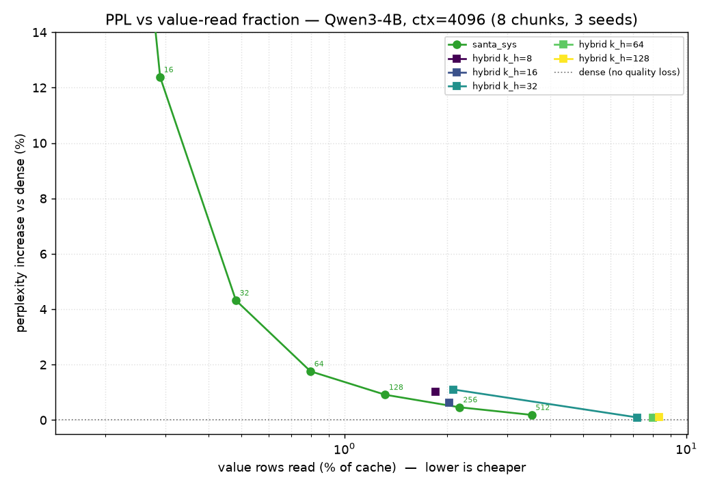

# Semi-Stochastic Sparse Attention

A research-validation prototype exploring whether you can make LLM text generation cheaper by **randomly sampling** the attention cache instead of reading all of it — without distorting the model's output on average.

> **One-line status.** Statistical core + hybrid estimator + contiguous-block sampling built, unbiased, and gated; all running end-to-end in a real Qwen3-4B via a perplexity harness; **85 tests pass** (no GPU/model needed). Authoritative spec: `PROTOTYPE_DESIGN.md`. Hardware: one 16 GB RTX 5060 Ti (Blackwell).

## Executive summary

**Motivation.** At decode time an LLM is bottlenecked by **memory bandwidth, not compute** — each new token re-reads the entire KV cache (plus the weights) from HBM. But attention is a softmax-weighted *average* of cached value vectors — an expectation over a probability distribution — so it can be **estimated by sampling a few values instead of reading all of them, without bias**. We reproduce the SANTA paper's estimator in plain PyTorch and push our own extensions, asking one disciplined question throughout: *how few cache reads can we get away with at no cost to the model's output (in expectation)?*

**Ideas.** (1) **Hybrid** — compute the few highest-weight tokens exactly, sample the diffuse tail (lower variance per sample). (2–3) **Reuse / resident** — recycle or skip reads across decode steps. (4–5) **Cross-head sharing** — one shared sample set / proposal across heads. (6) **Large value memory** — spend the now-cheap V-reads on more value capacity. (7) **Clustered-KV / skip-K** — reorganize the cache by key *content* so cheap per-cluster summaries decide *which* clusters to fetch, attacking the **key** reads that sampling alone can't avoid. All are unbiased by construction (Monte-Carlo / importance sampling), so they change the model's *memory traffic*, never its output.

**Status & honest results.** The statistical core (six estimators + variance harness) and the hybrid are built, proven unbiased, and reproduce the paper's `1/S` variance slopes; everything runs inside a real Qwen3-4B through a clean attention-op hook in the sibling `../llms` engine, scored by a teacher-forced perplexity harness. What we've actually found:
- **Plain sampling is remarkably good** — dense-model perplexity at **~3.5% of value reads (~28× fewer)** at 4096 context, the read fraction *shrinking* as context grows (attention concentrates).
- **The exact-head hybrid *ties* plain sampling on bytes** — it wins per-*sample*, but with-replacement collisions let plain sampling read the hot tokens essentially for free (an L2-cache effect) and cancel the head's edge. Measured, mechanism-confirmed, conclusive: the hybrid's value is variance-per-sample, not bytes-per-quality.
- **Contiguous-block sampling** is unbiased but loses on byte-count for *scattered* attention; its premise needs content-clustered keys.
- **Cluster diagnostic (the live frontier)** — estimating a cluster's mass from its *moments* is **dead** (attention mass sits on a single token per cluster), **but** ranking clusters by a **magnitude** estimate (cluster by direction + store per-key magnitudes) recovers **near-oracle key-read selection** (~0.2–0.3% of keys at deep layers vs the moment estimate's 6–35%) — reviving the skip-K prize.

**Next stage + our hypothesis.** Wire magnitude-ranked cluster selection into the model and measure perplexity vs **key + value** reads end-to-end. We expect it to **preserve perplexity while reading a small fraction of keys at long-context, concentrated layers** (where the diagnostic showed `mag ≈ oracle`), with the radius/MIPS bound as an unbiased safety net — but to **help little at early/diffuse layers**, and (per **Amdahl**, since weights dominate decode bandwidth) to cut *bytes* without necessarily cutting *wall-clock* on this card. Net expectation: a real, measurable **K + V read reduction at fixed quality**, strongest at long context — a genuine step beyond SANTA's V-only saving — whose hardware speedup stays an open, hardware-dependent question we deliberately don't chase here.

## The problem, briefly

When an LLM generates text one token at a time, each new token must "attend" to every previous token: the GPU re-reads the entire **KV cache** (a stored key and value vector for every past position, every attention head) from main memory. On a 16 GB consumer GPU this memory traffic — not raw compute — is what caps context length and keeps generation slow.

**Attention is a weighted average of the cached value vectors**, where the weights `A` are a softmax (they sum to 1, so `A` is a probability distribution). The expensive part is touching all of those values every step.

## The idea

If attention is an average over a probability distribution, you can **estimate** it by sampling: draw a handful of value rows according to their attention weights and average them. This is a standard Monte-Carlo estimator, and it is **unbiased** — its expected value equals the true dense attention output — with error that shrinks as roughly `1/S` for `S` samples. We reproduce this published result (the "SANTA" paper) in plain PyTorch, then test several of our own extensions (the headline three are below; the full set — cross-head sharing, large value memory, clustered-KV / skip-K — is in `PROTOTYPE_DESIGN.md`):

1. **Hybrid (deterministic head + sampled tail) — main contribution.** Compute the few highest-weight tokens *exactly* (zero error) and only sample the diffuse remainder. At the same read budget this should cut the estimator's variance — and the win grows the more attention mass sits in those top tokens.
2. **Reuse across steps.** Recycle values sampled on the previous decode step, reweighted by an importance ratio, to avoid re-reading memory — *if* you can prove the reweighting keeps the estimator unbiased and *if* those values are still cache-resident.
3. **Skip-resident.** Sample fresh each step but skip the memory read for blocks already sitting in cache; statistically identical to plain sampling, cheaper in bytes.

## What counts as success

This is about **correctness and statistics, not speed** (the real speedup lives on datacenter hardware we don't have). Concretely, in priority order:

1. **Variance harness** — prove each estimator is unbiased and that its error falls as `1/S`. Runs on tiny random tensors; this is the scientific core. *If the `1/S` slope doesn't reproduce, nothing downstream is valid.*
2. **Accuracy harness** — swap the sampled attention into a real small model (Qwen3-4B, BF16) on long-context tasks and measure task accuracy vs sample budget.
3. **Microbenchmark** — directional kernel-timing only, interpreted through an Amdahl's-law ceiling; we do **not** chase end-to-end speedup numbers on this card. We measure *bytes avoided*, not wall-clock.

## Two design choices worth knowing

- **GPU-friendly block sampling.** Memory is read in contiguous chunks, so we also sample ~1–2 KB **blocks** of values rather than scattered single rows, to match coalesced reads. We derived and tested its unbiasedness separately (it holds for every block size). *Finding so far:* on byte-count it doesn't help unless attention mass clusters contiguously — see results below.
- **We reuse a sibling project for the model.** The accuracy/microbench phases plug into [`../llms`](../llms) — a from-scratch, HuggingFace-bit-exact Qwen3 inference engine (same author, same GPU) — by swapping its attention op directly, rather than patching HuggingFace internals. The statistics core (`ssa/`) stays standalone.

## What's built so far

### 1. The statistical core (tiny random tensors, no model)

- **One swappable interface** `attn(q, K, V, impl=...)` with seven implementations: `dense` (ground truth), `topk` (biased baseline), the unbiased samplers `santa` (i.i.d.), `santa_strat` (stratified), `santa_sys` (systematic), `santa_hybrid` (Idea 1), and `santa_block` (contiguous-block sampling).
- **A measurement harness** for Monte-Carlo mean + variance-vs-budget, accumulating in float64 so low-precision roundoff is never mistaken for bias. Every result file in `src/ssa/results/` is stamped with git SHA, GPU, and library versions.

Both gates pass: every unbiased estimator's mean matches `dense` within Monte-Carlo error, and variance falls as ~`1/S` (slopes −1.0 i.i.d. / −1.3 stratified / −1.5 systematic — structured sampling beats i.i.d., reproducing the paper).

### 2. The hybrid estimator (Idea 1): a real win *per sample*

`santa_hybrid` computes the top-`k_h` keys exactly and samples only the renormalized remainder. Proven unbiased for every `k_h`/sampler combination, and at a matched **sample** budget it cuts variance sharply — **8× lower at `k_h=4`, 32× lower at `k_h=16`** vs plain systematic, growing with the head's mass share.


*Variance vs total sample budget (log-log). For the hybrid the budget counts **both** the exact head and the sampled tail (`k_h + S_tail`). Plain i.i.d. falls as `1/S` (slope −1); systematic is steeper; the hybrids fall faster still (−1.9 to −2.1).*

### 3. Real-model perplexity (Qwen3-4B, WikiText-103) — and an honest correction

The estimators run inside the sibling [`../llms`](../llms) Qwen3 engine, swapped in at decode time (prefill stays exact) through a small generic attention hook added to that engine (`ssa` never forks it). A teacher-forced perplexity harness scores real predictions under sampled attention; `ssa.harness.ppl_sweep` traces **perplexity vs value-read fraction**.



*Qwen3-4B, WikiText-103, 4096 context (8 chunks, 3 seeds). `santa_sys` (green) hits a sharp knee — near-dense by ~3.5% reads. The `santa_hybrid` points (squares) sit on or to the **right** of the sys curve: tied at small budgets, reading more for the same quality at large ones.*

- **Plain sampling is remarkably good:** `santa_sys` reaches dense-model perplexity (**+0.19%**) reading only **~3.5% of value rows (~28× fewer)** at 4096 context; the read fraction *shrinks* as context grows — it was ~6% at 2048 — because attention concentrates further with length.
- **The hybrid ties plain sampling on bytes — it does not beat it** (confirmed at both 2048 and 4096). At matched *reads* the two are within ~0–8% (e.g. at 4096, `hybrid(16,48)` is 2.0%/+0.62% vs sys ≈+0.56%); the high-`k_h` hybrids read **7–8%** for the same ~dense quality sys reaches by **~3.5–5%**. The reason is subtle: with-replacement sampling **collides** onto the few high-mass tokens, reading them essentially for free (a real GPU cache serves the repeats from L2), and that "collision leverage" exactly cancels the head's variance advantage. So the hybrid's win is in *variance per sample*, not *bytes per quality* — it would only pay off on hardware that can't reuse a fetched value.
- **`topk` is a biased red herring** (seen in the [2048 cheap-end sweep](docs/ppl_frontier_cheap2k.png)): catastrophic at low `k` (+6000% perplexity at `k=1`), yet *below* dense for `k≥16` — a denoising artifact of truncating the noisy attention tail, not a fair comparison for the unbiased methods.

We confirmed the mechanism directly: a [concentration diagnostic](src/ssa/harness/concentration.py) measures attention's effective support at **~14 of ~1500 tokens**, and a closed-form collision formula predicts the measured read fractions to within rounding. A [crossover probe](src/ssa/harness/crossover.py) sweeping concentration finds **no regime where the hybrid decisively wins on bytes** — the two effects cancel everywhere.

### 4. Contiguous-block sampling (`santa_block`)

Unbiased for every block size (gate passes; `B=1`≡`santa`, `B≥n_k`≡`dense`). But **at a fixed byte budget, larger blocks have higher variance *and* read more** — dominated by row-level sampling, because blocks defeat the collision dedup above and waste reads on the cold rows inside each block.


This is on *spatially unstructured* synthetic attention; block sampling's real premise is that attention mass clusters *contiguously*, plus that contiguous reads are cheaper-per-byte on hardware — neither of which this byte-count harness captures.

**The proposed fix (Idea 7 — design doc §3.9): reorganize the KV cache so each contiguous block holds *similar* keys.** Then a block is uniformly hot or cold for any query, so a sampled hot block's rows are all useful. Because block sampling is unbiased for *any* grouping, clustering can never introduce bias — it's a pure efficiency substrate (unlike biased cluster-selection methods like Reformer/Routing-Transformer/Quest). And it unlocks a bigger prize — **skipping the *key* reads too** (decide which clusters to fetch from cheap per-cluster summaries). A kernel-free diagnostic on the real model (next section) then settled *how*: estimating a cluster's mass from its moments fails, but a **magnitude-based** estimate works.

---

**Tests:** all **85 pass** with no model download or GPU required (`uv run pytest`). The real-model sweeps are reproducible on the GPU box via `python -m ssa.harness.ppl_sweep` / `concentration` / `crossover` / `plot_blocks` / `cluster_diag`.

**Cluster diagnostic (Idea 7, design doc §3.10).** A kernel-free Step-0 on real Qwen3-4B keys ([`ssa.harness.cluster_diag`](src/ssa/harness/cluster_diag.py)) settled the "skip the key reads too" idea: the *moment-based* free-energy estimate is **dead** (attention mass sits on a single token per cluster — `within_PR≈1` everywhere — so a 2-moment Gaussian can't estimate it), **but** a *magnitude*-based estimate (cluster by direction, store per-key magnitudes, rank by `Σ e^{|k_j|(q·ĉ_b)}`) recovers **near-oracle key-read selection at the concentrated deep layers** (~0.2–0.3% of keys vs the Gaussian's 6–35%). So skip-K is alive via the magnitude route; next is to test it end-to-end (does that selection preserve perplexity?).

**The magnitude estimate — what it is, and how it becomes a bound.** Split each key into magnitude × direction, `k_j = |k_j|·k̂_j`, so the true term is `e^{q·k_j} = e^{|k_j|(q·k̂_j)}`. The estimate replaces each key's *own* direction with the cluster's center direction `ĉ_b` but keeps its *true* magnitude:

```
m̂_b = Σ_{j∈b} e^{|k_j|(q·ĉ_b)}    estimates    m_b = Σ_{j∈b} e^{|k_j|(q·k̂_j)}
```

So it's a per-term plug-in estimate of `e^{q·k_j}`, **exact iff the cluster has zero angular spread**. The error lives in the exponent, `s_j − ŝ_j = |k_j|·q·(k̂_j − ĉ_b)`, bounded by `|k_j|·‖q‖·ρ_b` (Cauchy–Schwarz), where `ρ_b = max_{j∈b}‖k̂_j − ĉ_b‖` is the cluster's **angular** radius. Adding/subtracting that term gives rigorous bounds:

```
Σ_j e^{|k_j|[(q·ĉ_b) − ‖q‖ρ_b]}  ≤  m_b  ≤  Σ_j e^{|k_j|[(q·ĉ_b) + ‖q‖ρ_b]}
```

`m̂_b` is the `ρ_b = 0` *center* of this band — what you **rank** by (great when direction-clustering makes `ρ_b` small). The **upper** bound is the unbiased safety net for skip-K: never skip a cluster whose upper bound could beat your current best (MIPS branch-and-bound ⇒ provably never miss the hottest token). It's strictly tighter than the earlier Euclidean-radius bound `|b|·e^{q·c_b + ‖q‖R_b}` because it uses the *exact* magnitudes and only bounds *direction*. Selection (rank by center) and guarantee (use upper bound) are the same expression at `ρ_b = 0` vs `+ρ_b`, both tightening as direction-clustering shrinks `ρ_b`.

**Not yet built / next:** the end-to-end magnitude-ranked selection test; wiring `santa_block` into the real model; reuse/resident caching (Ideas 2–3), cross-head sharing (Ideas 4–5), large sparse value memory (Idea 6); and the kernel microbenchmark.

## Glossary — every named concept, one line

The through-line: the *physics* of a cluster's attention mass (left) meets the *computer science* of finding it cheaply (right). We *expected* them to join at "estimate a cluster's free energy from its moments" — but the diagnostic killed that (mass sits on one token per cluster) and the working route turned out to be ranking clusters by a magnitude estimate (§3.10).

**Statistical mechanics & probability**
- **Boltzmann / Gibbs distribution** — `p_i ∝ e^{−E_i/T}`; softmax attention *is* this, with score `q·k` = −energy, so the weights are a Gibbs distribution over tokens.
- **Partition function `Z`** — the normalizer `Σ e^{score}` (the softmax denominator); a cluster's mass is its own partition function.
- **Free energy / log-sum-exp** — `log Z`, the smooth max; the cluster's "effective score" we sample by, `log⟨e^{q·k}⟩_b`, is its free energy.
- **Jensen's inequality** — for convex `f`, `E[f(X)] ≥ f(E[X])`; the gap is why a spread cluster (mean-of-exp) samples *hotter* than its center (exp-of-mean).
- **Cumulants / cumulant generating function** — derivatives of `log Z` give mean, variance, …; their series *is* `s_b^eff = mean + ½var + …`.
- **Exponential family / log-normalizer** — family where `∇log Z = mean`, `∇²log Z = covariance`; why `½ qᵀΣ_b q` is the natural second-order term.
- **Fisher information** — the curvature `∇²log Z = covariance`; here exactly the fluctuation term `qᵀΣ_b q`.
- **Laplace / saddle-point approximation** — approximate a peaked sum by a Gaussian around its max; our mass estimate `e^{q·c_b + ½qᵀΣ_b q}` is this for a cluster.
- **Mean-field / saddle value** — collapse a distribution to its average; `e^{q·c_b}` (exp of the mean) is the mean-field estimate that misses fluctuations.
- **One-loop correction** — the Gaussian-fluctuation term past the saddle; here the `½ qᵀΣ_b q`.
- **Chebyshev–Markov moment problem** — the tightest bound on `E[f(X)]` given a few moments + support, attained by an extremal few-point distribution; gives a mass upper bound *sharper* than "all members at the max."
- **Participation ratio (≡ inverse Simpson ≡ 1/Herfindahl)** — `1/Σ p²`, the effective number of components carrying the mass; attention's is **~14 of ~1500** tokens.
- **Entropy** — `−Σ p log p`, another concentration gauge; `e^{entropy} ≈ 14` cross-checks the participation ratio.

**Estimation & variance reduction**
- **Monte Carlo** — estimate a sum by random draws; the whole sampled-attention idea.
- **Importance sampling** — unbiased estimation under a cheap proposal, reweighting by true/proposal; lets us sample clusters by a centroid proposal yet stay exact.
- **Rao–Blackwellization** — replace a random estimate by its exact conditional expectation to cut variance; computing the deterministic head *exactly* is literally this.
- **Control variate** — subtract a correlated, known-mean term to reduce variance; the other lens on the exact-head hybrid.
- **Stratified sampling** — equal-mass strata, one draw each; `santa_strat`.
- **Systematic sampling** — one shared offset, evenly spaced (the "comb"); `santa_sys`.
- **Cauchy–Schwarz** — `|q·δ| ≤ ‖q‖‖δ‖`; turns a cluster's radius `R_b` into the max-score bound `q·c_b + ‖q‖R_b`.

**Search & data structures**
- **Maximum Inner Product Search (MIPS)** — find the keys with largest `q·k`; "never miss the hottest token" is top-1 MIPS.
- **Branch and bound** — prune a search with cheap bounds that rule regions out; the radius bound skips clusters that provably can't hold the max.
- **Fagin's Threshold Algorithm (TA/NRA)** — provably read-*minimal* top-k retrieval via a running threshold; our "read the best, set `s*`, prune the rest" is this.
- **k-means / Lloyd's algorithm** — cluster points to minimize within-cluster radius; the baseline key-grouping (we want a query-aware variant instead).
- **Mahalanobis distance** — covariance-weighted distance; the *right* metric, since what matters is `qᵀΣq` along query directions, not Euclidean radius.
- **Cuckoo hashing** — insertion by displacement chains where one empty slot propagates; the model for online KV-cluster maintenance.
- **Gram matrix** — the matrix of pairwise `k_i·k_j`; the "relative dot products" fixing a cluster's within-block score geometry.

**Attention / ML prior art**
- **RoPE (Rotary Position Embedding)** — rotates `q,k` by position so the score depends only on relative offset; its fast high-frequency rotation may scramble content-clustering.
- **Modern Hopfield Networks ("Hopfield Networks is All You Need")** — derives attention as the fixed point of an *energy/free-energy* minimization; closest prior art to our energy framing (and the source of the "…is All You Need" riff).
- **Reformer (LSH attention)** — buckets keys by locality-sensitive hashing; prior art for grouping keys, but *biased* hard selection.
- **Routing Transformer** — k-means-clusters keys and attends within clusters; closest "cluster the keys" prior art, again biased.
- **Quest / ClusterKV** — select KV blocks by representative vectors at decode; prior art for block selection, biased rather than unbiased-sampled.
- **Amdahl's law** — total speedup is capped by the part you *don't* accelerate (`1/w`, `w` = weight-read share); why faster attention can't beat the weight-bandwidth ceiling at decode.
- **SANTA / S²ANTA** — the paper we reproduce: unbiased semi-stochastic sampling of the KV cache; everything here builds on its estimator.

## Repository

- `PROTOTYPE_DESIGN.md` — full spec, phase ordering, and correctness gates. **Read this first** (especially §0.5, the current decisions).
- `CLAUDE.md` — orientation for AI coding assistants working in this repo.
- `santa-wiki.html` — background notes on the SANTA method.
