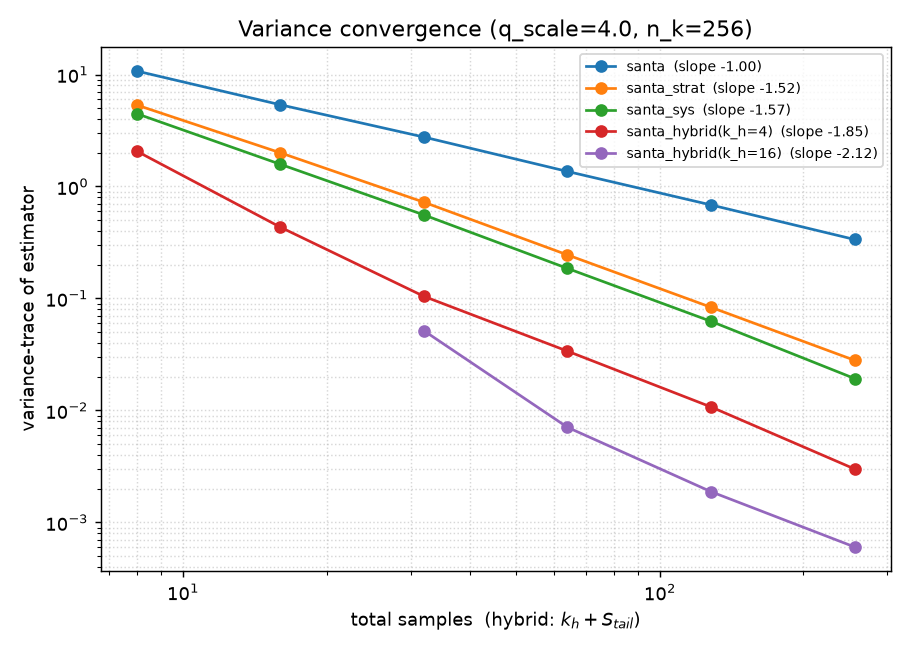
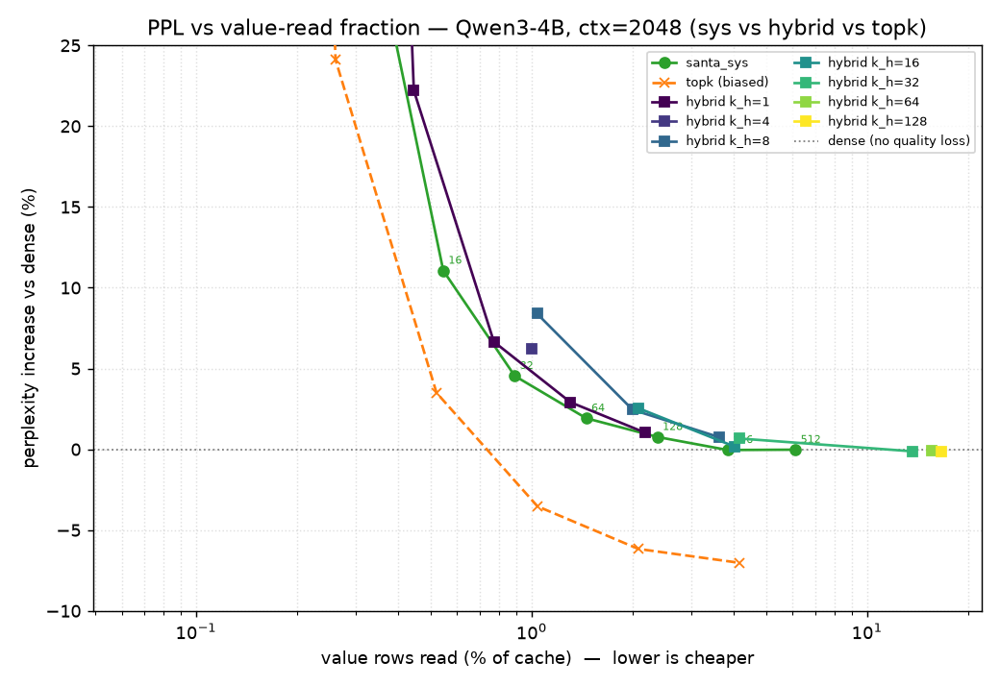
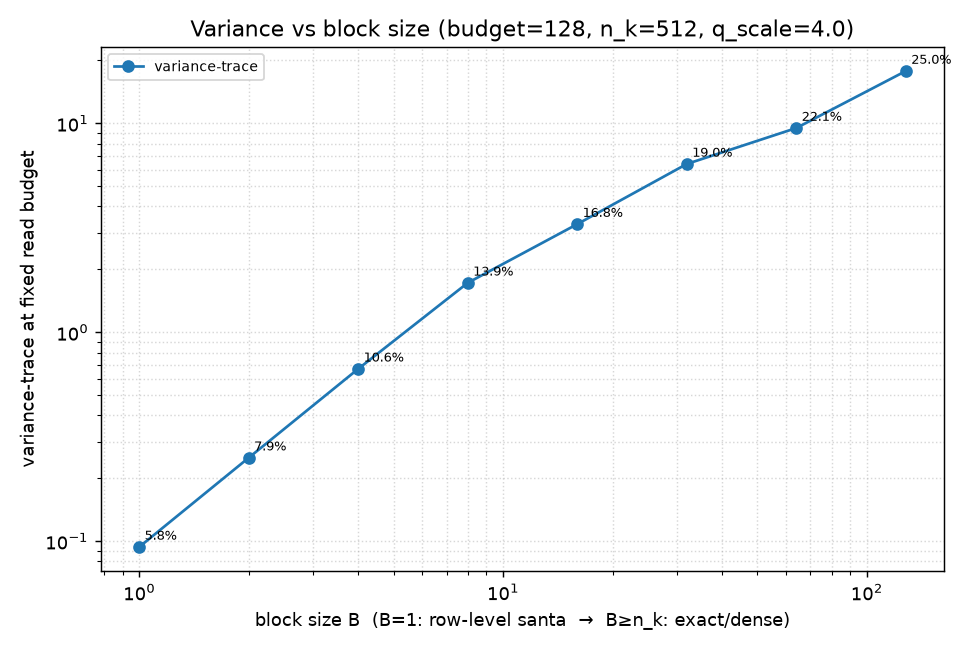

# Semi-Stochastic Sparse Attention

A research-validation prototype exploring whether you can make LLM text generation cheaper by **randomly sampling** the attention cache instead of reading all of it — without distorting the model's output on average.

> **Status.** Statistical core, the hybrid estimator (Idea 1), and contiguous-block sampling are built and gated; all run end-to-end inside a real Qwen3-4B with a perplexity harness. Headline result: random sampling reaches dense-model quality reading **~3.5% of cached values (~28× fewer)**, and — a careful, honest finding — the "exact head" hybrid roughly *ties* plain sampling on bytes once you account for how GPU caches dedup repeated reads. `PROTOTYPE_DESIGN.md` is the authoritative spec. Target hardware: a single 16 GB RTX 5060 Ti (Blackwell).

## The problem, briefly

When an LLM generates text one token at a time, each new token must "attend" to every previous token: the GPU re-reads the entire **KV cache** (a stored key and value vector for every past position, every attention head) from main memory. On a 16 GB consumer GPU this memory traffic — not raw compute — is what caps context length and keeps generation slow.

**Attention is a weighted average of the cached value vectors**, where the weights `A` are a softmax (they sum to 1, so `A` is a probability distribution). The expensive part is touching all of those values every step.

## The idea

If attention is an average over a probability distribution, you can **estimate** it by sampling: draw a handful of value rows according to their attention weights and average them. This is a standard Monte-Carlo estimator, and it is **unbiased** — its expected value equals the true dense attention output — with error that shrinks as roughly `1/S` for `S` samples. We reproduce this published result (the "SANTA" paper) in plain PyTorch, then test three of our own extensions:

1. **Hybrid (deterministic head + sampled tail) — main contribution.** Compute the few highest-weight tokens *exactly* (zero error) and only sample the diffuse remainder. At the same read budget this should cut the estimator's variance — and the win grows the more attention mass sits in those top tokens.
2. **Reuse across steps.** Recycle values sampled on the previous decode step, reweighted by an importance ratio, to avoid re-reading memory — *if* you can prove the reweighting keeps the estimator unbiased and *if* those values are still cache-resident.
3. **Skip-resident.** Sample fresh each step but skip the memory read for blocks already sitting in cache; statistically identical to plain sampling, cheaper in bytes.

## What counts as success

This is about **correctness and statistics, not speed** (the real speedup lives on datacenter hardware we don't have). Concretely, in priority order:

1. **Variance harness** — prove each estimator is unbiased and that its error falls as `1/S`. Runs on tiny random tensors; this is the scientific core. *If the `1/S` slope doesn't reproduce, nothing downstream is valid.*
2. **Accuracy harness** — swap the sampled attention into a real small model (Qwen3-4B, BF16) on long-context tasks and measure task accuracy vs sample budget.
3. **Microbenchmark** — directional kernel-timing only, interpreted through an Amdahl's-law ceiling; we do **not** chase end-to-end speedup numbers on this card. We measure *bytes avoided*, not wall-clock.

## Two design choices worth knowing

- **GPU-friendly block sampling.** Memory is read in contiguous chunks, so we also sample ~1–2 KB **blocks** of values rather than scattered single rows, to match coalesced reads. We derived and tested its unbiasedness separately (it holds for every block size). *Finding so far:* on byte-count it doesn't help unless attention mass clusters contiguously — see results below.
- **We reuse a sibling project for the model.** The accuracy/microbench phases plug into [`../llms`](../llms) — a from-scratch, HuggingFace-bit-exact Qwen3 inference engine (same author, same GPU) — by swapping its attention op directly, rather than patching HuggingFace internals. The statistics core (`ssa/`) stays standalone.

## What's built so far

### 1. The statistical core (tiny random tensors, no model)

- **One swappable interface** `attn(q, K, V, impl=...)` with seven implementations: `dense` (ground truth), `topk` (biased baseline), the unbiased samplers `santa` (i.i.d.), `santa_strat` (stratified), `santa_sys` (systematic), `santa_hybrid` (Idea 1), and `santa_block` (contiguous-block sampling).
- **A measurement harness** for Monte-Carlo mean + variance-vs-budget, accumulating in float64 so low-precision roundoff is never mistaken for bias. Every result file in `src/ssa/results/` is stamped with git SHA, GPU, and library versions.

Both gates pass: every unbiased estimator's mean matches `dense` within Monte-Carlo error, and variance falls as ~`1/S` (slopes −1.0 i.i.d. / −1.3 stratified / −1.5 systematic — structured sampling beats i.i.d., reproducing the paper).

### 2. The hybrid estimator (Idea 1): a real win *per sample*

`santa_hybrid` computes the top-`k_h` keys exactly and samples only the renormalized remainder. Proven unbiased for every `k_h`/sampler combination, and at a matched **sample** budget it cuts variance sharply — **8× lower at `k_h=4`, 32× lower at `k_h=16`** vs plain systematic, growing with the head's mass share.

*Variance vs total sample budget (log-log). For the hybrid the budget counts **both** the exact head and the sampled tail (`k_h + S_tail`). Plain i.i.d. falls as `1/S` (slope −1); systematic is steeper; the hybrids fall faster still (−1.9 to −2.1).*

### 3. Real-model perplexity (Qwen3-4B, WikiText-103) — and an honest correction

The estimators run inside the sibling [`../llms`](../llms) Qwen3 engine, swapped in at decode time (prefill stays exact) through a small generic attention hook added to that engine (`ssa` never forks it). A teacher-forced perplexity harness scores real predictions under sampled attention; `ssa.harness.ppl_sweep` traces **perplexity vs value-read fraction**.

- **Plain sampling is remarkably good:** `santa_sys` reaches dense-model perplexity reading only **~3.5% of value rows (~28× fewer)** at 4096 context; the read fraction *shrinks* as context grows (attention gets more concentrated).
- **The hybrid ties plain sampling on bytes — it does not beat it.** At a matched *read* budget the two are within ~0–8% (a near-tie). The reason is subtle and important: with-replacement sampling **collides** onto the few high-mass tokens, so it reads them essentially for free (a real GPU cache serves the repeats from L2). That free "collision leverage" exactly cancels the head's variance advantage. So the hybrid's win is in *variance per sample*, not *bytes per quality* — it would only pay off on hardware that can't reuse a fetched value.
- **`topk` is a biased red herring:** catastrophic at low `k` (+6000% perplexity at `k=1`), yet *below* dense for `k≥16` — a denoising artifact of truncating the noisy attention tail, not a fair comparison for the unbiased methods.

We confirmed the mechanism directly: a [concentration diagnostic](src/ssa/harness/concentration.py) measures attention's effective support at **~14 of ~1500 tokens**, and a closed-form collision formula predicts the measured read fractions to within rounding. A [crossover probe](src/ssa/harness/crossover.py) sweeping concentration finds **no regime where the hybrid decisively wins on bytes** — the two effects cancel everywhere.

### 4. Contiguous-block sampling (`santa_block`)

Unbiased for every block size (gate passes; `B=1`≡`santa`, `B≥n_k`≡`dense`). But **at a fixed byte budget, larger blocks have higher variance *and* read more** — dominated by row-level sampling, because blocks defeat the collision dedup above and waste reads on the cold rows inside each block.

This is on *spatially unstructured* synthetic attention; block sampling's real premise is that attention mass clusters *contiguously* (a recent window, a relevant span), plus that contiguous reads are cheaper-per-byte on hardware — neither of which this byte-count harness captures. So blocks need a real model to be judged fairly (the deferred follow-up).

---

**Tests:** all **79 pass** with no model download or GPU required (`uv run pytest`). The real-model sweeps are reproducible on the GPU box via `python -m ssa.harness.ppl_sweep` / `concentration` / `crossover` / `plot_blocks`.

**Not yet built:** reuse/resident caching (Ideas 2–3), cross-head sharing (Ideas 4–5), large sparse value memory (Idea 6), wiring `santa_block` into the real model (to test contiguous locality), and the kernel microbenchmark.

## Repository

- `PROTOTYPE_DESIGN.md` — full spec, phase ordering, and correctness gates. **Read this first** (especially §0.5, the current decisions).
- `CLAUDE.md` — orientation for AI coding assistants working in this repo.
- `santa-wiki.html` — background notes on the SANTA method.
