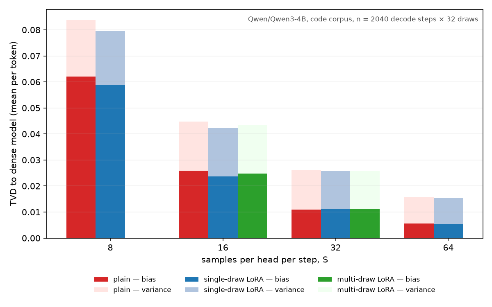

# Semi-Stochastic Sparse Attention

When a large language model (LLM) generates text, each new token attends to every earlier token. To do that, the GPU re-reads a stored key and value vector for every past position (the KV cache) from its main memory (HBM, high-bandwidth memory). At decode time that memory traffic, not arithmetic, limits speed. This repository tests whether attention can instead be **estimated by randomly sampling a small part of the cache**, in a way that is unbiased: the expected output equals exact attention.

I built this as a research prototype. It reproduces the sampled-attention estimator from *Stochastic Sparse Attention for Memory-Bound Inference* ([arXiv:2605.01910](https://arxiv.org/abs/2605.01910), whose authors call the method SANTA) in plain PyTorch, then tests several extensions of it inside a real model, Qwen3-4B. All 98 tests run on CPU without downloading a model (`uv run pytest`).

## Summary of results

- **Plain sampling works well.** Systematic sampling (`santa_sys`) matches dense perplexity to within +0.19% (s.d. 0.06% over 3 seeds) while reading 3.5% of cached values, about 28× fewer. That was measured on Qwen3-4B, WikiText-103, at 4096-token context over 8 chunks.
- **Computing the heaviest tokens exactly does not save reads.** The hybrid estimator, which computes the top-weighted tokens exactly and samples the rest, has much lower variance per sample. It ties plain sampling once you count *distinct* values read, because repeated draws of the few hot tokens cost plain sampling nothing extra.
- **Reading contiguous blocks costs more.** Block sampling stays unbiased, but at a fixed read budget its variance grows with block size on unstructured attention.
- **Skipping key reads by cluster selection fails in the version tested.** Deterministically keeping the top key clusters needs about 60% of keys to preserve perplexity, because attention's long tail of small weights carries too much total mass to drop.
- **Sampling bias exists, and a small adapter does not remove it.** Averaged over draws, sampled attention still shifts the next-token distribution. This systematic bias is 74% of the per-draw error at 8 samples. A rank-16 low-rank adapter (LoRA) trained to reduce it removes at most 8%.

## Background

Attention at one decode step is a weighted average of the cached value vectors. The weights `A` come from a softmax, so they are non-negative and sum to 1, which makes attention an expectation over a probability distribution. An expectation can be estimated by Monte Carlo: draw `S` value rows with probability `A` and average them. The estimate is unbiased, and its variance falls as roughly `1/S`, or faster with structured sampling. The cost that matters is how many distinct value rows are fetched from memory.

## Estimators

`attn(q, K, V, impl=...)` exposes one interface with these implementations:

| `impl` | what it does | unbiased |
|---|---|---|
| `dense` | exact attention (reference) | — |
| `topk` | keeps the `k` highest-weight tokens, renormalizes | no |
| `santa` | `S` independent draws from `A` | yes |
| `santa_strat` | stratified: one draw from each of `S` equal-mass strata | yes |
| `santa_sys` | systematic: one random offset, `S` evenly spaced draws | yes |
| `santa_hybrid` | top-`k_h` tokens exact, remaining mass sampled | yes |
| `santa_block` | samples contiguous blocks of `B` rows | yes |
| `skip_k` | reads only the key clusters ranked highest by a cheap estimate | no |

The measurement harness accumulates in float64, so low-precision roundoff is never mistaken for bias. Every result file in `src/ssa/results/` records the git commit, GPU, and library versions that produced it.

## Results

### Unbiasedness and variance on synthetic attention

Every unbiased estimator's Monte Carlo mean matches `dense` within sampling error (largest |z| = 2.4 over all output entries at S=64). Variance falls with sample count `S` with fitted log-log slopes of −1.00 for `santa`, −1.34 for `santa_strat`, and −1.49 for `santa_sys` (S = 8–256, 400 runs, 256 keys). These reproduce the paper's finding that structured sampling beats independent draws.


For the hybrid, the budget on the x-axis counts both the exact head and the sampled tail (`k_h + S_tail`). At equal total budget, the hybrid's variance is 3.6–6.4× lower than `santa_sys` with `k_h = 4`, and 11–33× lower with `k_h = 16` (budgets 32–256; 800 runs, 256 keys, query scale 4). These synthetic-tensor numbers are single fits with no interval computed.

### Real-model perplexity

The estimators replace attention inside Qwen3-4B (in BF16, the 16-bit brain floating-point format) during decode, while the prompt is still processed exactly. The model runs on a from-scratch Qwen3 inference engine I wrote separately ([github.com/aaholmes/llms](https://github.com/aaholmes/llms)); a small hook in that engine lets this package swap the decode attention op. `ssa.harness.ppl_sweep` scores teacher-forced perplexity as a function of the fraction of value rows read.


- `santa_sys` with S=512 reads 3.5% of value rows and raises perplexity by +0.19% (s.d. 0.06%, 3 seeds, 8 chunks of 4096 tokens). At fixed S the read fraction falls as context grows: at S=256 it is 3.8% at 2048 tokens and 2.2% at 4096.
- The hybrid ties `santa_sys` on reads. `santa_hybrid(k_h=16, S=48)` reads 2.0% for +0.62% (s.d. 0.03%), while `santa_sys` at S=256 reads 2.2% for +0.46% (s.d. 0.05%). The hybrids with large heads reach +0.1% but read 7–8% of rows to do it.
- The mechanism is collisions. Attention in Qwen3-4B concentrates on few tokens: the participation ratio `1/Σ A²`, the effective number of tokens carrying the weight, averages 14.5 out of 1536 cached tokens (2048-token context, all layers and heads). Sampling with replacement therefore draws the few hot tokens repeatedly, and a GPU cache serves those repeats without another memory read. That cancels the hybrid's variance advantage once reads are counted. A synthetic sweep over concentration (`ssa.harness.crossover`, participation ratio 10 to 493) found no setting where the hybrid reads meaningfully less for equal variance.
- `topk` is biased and behaves erratically. At 2048 context, k=1 gives perplexity 820 compared with 13.1 for dense, while for k ≥ 16 it scores *below* dense ([figure](docs/ppl_frontier_cheap2k.png)). Truncating the tail changes the model rather than approximating it, so it is not a like-for-like comparison with the unbiased methods.

### Contiguous-block sampling

`santa_block` is unbiased for every block size B (B = 1 reduces to `santa`; B ≥ number of keys reduces to `dense`). On synthetic attention at a fixed budget of 128 reads out of 512 keys, larger blocks give both higher variance and a larger distinct-read fraction (5.8% at B=1, 25% at B=128), because each sampled block spends reads on its cold rows and defeats the collision savings above.


Blocks would only pay off if attention mass clustered in contiguous positions, or if contiguous reads were enough cheaper per byte on the hardware; this byte-count harness measures neither. `ssa.harness.plot_blocks` also tests one proposed fix: reorder the cache so each block holds keys with similar content (k-means on the keys). Block sampling stays unbiased under any reordering. The figure above predates that option, so it shows the native order only.

### Skipping key reads

Sampling saves value reads, but computing the weights `A` still reads every key. I tested whether cheap per-cluster summaries could decide which key clusters to read at all.

A diagnostic on real Qwen3-4B keys (`ssa.harness.cluster_diag`) found two things. Estimating a cluster's total attention weight from its mean and covariance fails, because the weight inside each cluster sits on a single token (within-cluster participation ratio ≈ 1). A *magnitude* estimate ranks better. It clusters keys by direction and keeps each key's true length. With 8-key clusters at the two deepest layers sampled (24 and 35), it captures 99% of the attention weight while reading 0.24–0.32% of keys, compared with a best possible 0.19–0.26%; the Gaussian estimate needs 22–35%. With 16-key clusters it does much worse (8–12% of keys). Setting: one KV head, 1024-token prompt, 32 decode steps, layers 0, 12, 24, 35.

End to end, the ranking was not enough. With `skip_k`, which reads only the top-ranked clusters and drops the rest, perplexity is +1.4% at 60% of keys read and +92% at 17% (640-token context, 2 chunks, 1 seed). With `santa_sys` at S=256, 9.2% of rows are read and perplexity is within 1% of dense. Dropping clusters discards the long tail of small attention weights, and that tail matters in aggregate; sampling covers it cheaply. Two variants remain untested: selecting clusters to a fixed key budget, and an unbiased version that samples the unselected clusters rather than dropping them.

**The magnitude estimate and its bounds.** Write each key as length times direction, `k_j = |k_j| k̂_j`, so the exact term is `e^{q·k_j} = e^{|k_j|(q·k̂_j)}`. The estimate keeps each key's true length but replaces its direction with the cluster's mean direction `ĉ_b`:

```
m̂_b = Σ_{j∈b} e^{|k_j|(q·ĉ_b)}    estimates    m_b = Σ_{j∈b} e^{|k_j|(q·k̂_j)}
```

It is exact when all keys in the cluster point in one direction. The exponent error is `|k_j| q·(k̂_j − ĉ_b)`, which the Cauchy–Schwarz inequality bounds by `|k_j| ‖q‖ ρ_b`, where `ρ_b = max_{j∈b} ‖k̂_j − ĉ_b‖` is the cluster's angular radius. That gives rigorous bounds:

```
Σ_j e^{|k_j|[(q·ĉ_b) − ‖q‖ρ_b]}  ≤  m_b  ≤  Σ_j e^{|k_j|[(q·ĉ_b) + ‖q‖ρ_b]}
```

`m̂_b` is the centre of this band and is what clusters are ranked by. The upper bound supports a guarantee: a cluster whose upper bound falls below the best score found so far cannot hold the top token, so a branch-and-bound search that skips only such clusters never misses it. Because it uses each key's exact length and bounds only the direction, it is tighter than the simpler bound `|b| e^{q·c_b + ‖q‖R_b}` built from the cluster's Euclidean radius `R_b`.

### Bias of sampled decoding

Each sampled step is unbiased, but the model feeds that step through nonlinear layers, so the expected next-token distribution still differs from the dense one (a Jensen gap). `ssa.harness.bias_isolate` separates this systematic bias from per-draw noise by averaging 32 draws per step. It measures both as total variation distance (TVD) from the dense model's next-token distribution. Setting: Qwen3-4B, code corpus, 2040 decode steps.



| S | bias (TVD) | bias share of per-draw error | bias with LoRA |
|---:|---:|---:|---:|
| 8 | 0.062 | 74% | 0.059 |
| 16 | 0.026 | 58% | 0.024 |
| 32 | 0.011 | 42% | 0.011 |
| 64 | 0.0056 | 36% | 0.0054 |

The bias falls roughly as `1/S` (fitted exponent −1.16) and dominates the per-draw error at low S. A rank-16 LoRA adapter trained per S to reduce TVD (`ssa.harness.debias_train`) removes 0–8% of it. Training on the multi-draw average instead, which targets bias directly, does no better (S=16: 0.025; S=32: 0.011). On WikiText-103 at S=32 the bias is 0.034 and the adapter lowers it to 0.033. These runs saved only per-S averages, not per-step values, so no intervals are available.

## Not yet built

- Reusing samples across decode steps, reweighted by an importance ratio, and skipping reads for blocks still in the GPU's L2 cache.
- Sharing one sample set across attention heads.
- Larger per-token value vectors, of which only a sampled slice is ever read.
- A real gather-kernel benchmark. The results above count bytes read, not wall-clock time; the one timing note is [docs/timing_unique_counts.md](docs/timing_unique_counts.md).

## Glossary

- **Participation ratio** — `1/Σ p²`, the effective number of items carrying a distribution's mass.
- **Partition function / free energy** — softmax weights have the Boltzmann form `p_i ∝ e^{q·k_i}`; a cluster's summed weight is its partition function `Z_b`, and `log Z_b` is its free energy.
- **Jensen gap** — the difference `E[f(X)] − f(E[X])` for a nonlinear `f`; why unbiased attention outputs can still bias the model's output.
- **Importance sampling** — drawing from a convenient distribution and reweighting by true/proposal probability to stay unbiased.
- **Rao–Blackwellization / control variate** — replacing part of a random estimate by its exact value to reduce variance; the hybrid's exact head does this.
- **Stratified / systematic sampling** — splitting the distribution into `S` equal-mass strata and drawing once per stratum, independently (stratified) or with one shared offset (systematic).
- **Maximum inner product search (MIPS)** — finding the keys with the largest `q·k`.
- **Branch and bound** — a search that discards regions whose bound shows they cannot contain the best answer.
- **LoRA (low-rank adaptation)** — fine-tuning by adding small trainable low-rank matrices to frozen weights.
- **TVD (total variation distance)** — half the L1 distance between two probability distributions.
- **Prior art that selects keys with a bias** — Reformer (hashes keys into buckets), Routing Transformer (k-means clusters of keys), and Quest/ClusterKV (select cache blocks by representative vectors). All select deterministically, unlike the unbiased sampling here.

## Repository

- `src/ssa/attn/` — the estimators; `src/ssa/sampling/` — per-head cumulative distributions and index draws.
- `src/ssa/harness/` — variance, perplexity, concentration, clustering, and bias harnesses, plus plotting. Real-model harnesses need a CUDA GPU and download Qwen3-4B.
- `src/ssa/models/patch.py` — the adapter that plugs the estimators into the inference engine.
- `src/ssa/results/` — result files and figures.
- `run_bias_isolate.sh`, `run_multidraw_debias.sh` — the bias and adapter experiments; each step is skipped if its output exists.

Setup: `uv sync`, then `uv run pytest`. The engine dependency is installed from [github.com/aaholmes/llms](https://github.com/aaholmes/llms) at a pinned commit.

## License

Apache License 2.0; see [LICENSE](LICENSE).
